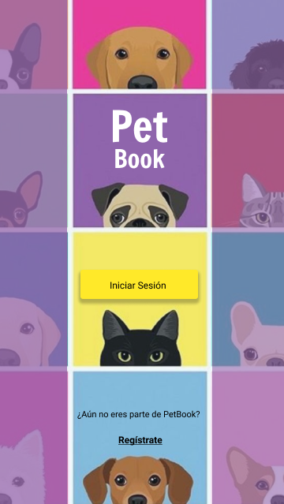
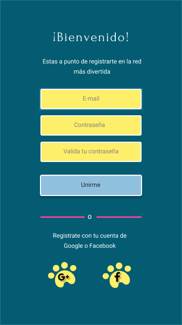
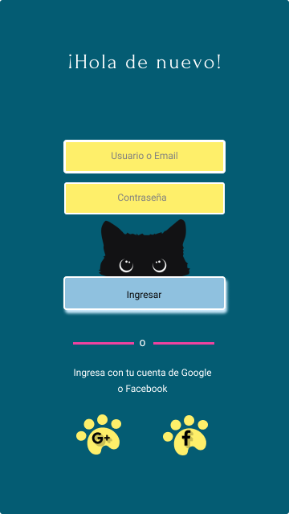
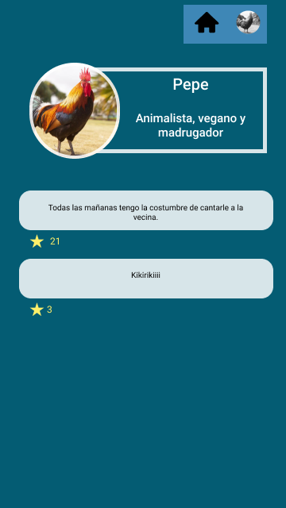
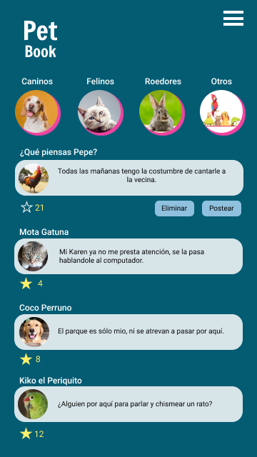

## ***PET BOOK***

## Índice

* [1. Definición del producto](#1-definición-del-producto)
* [2. Resumen del proyecto](#2-resumen-del-proyecto)
* [3. Objetivos de aprendizaje](#3-objetivos-de-aprendizaje)
* [4. Consideraciones generales](#4-consideraciones-generales)
* [5. Criterios de aceptación mínimos del proyecto](#5-criterios-de-aceptación-mínimos-del-proyecto)
* [6. Hacker edition](#6-hacker-edition)
* [7. Entrega](#7-entrega)
* [8. Pistas, tips y lecturas complementarias](#8-pistas-tips-y-lecturas-complementarias)

## 1. Definición del producto 

Siempre las mascotas han sido parte de nuestras familias y hogares, los mas mimados, por esto creamos Pet Book,
una red social pensada para compartir momentos especiales, divertidos y tiernos.

Nuestro usuario principal es el dueño de la mascota inscrita, quien se interesa tanto en su bienestar como en compartir las vivencias de su compañero fiel. Sin embargo tambien esperamos usuarios que busquen adoptar, socializar o compartir tips.

Nuestros clientes son los pet shops, veterinarias y demás comercios que venden artículos para mascotas, ya que centralizamos su nicho de mercado y promovemos una comunidad pet friendly.

Somos una red social que busca unir a las mascotas del mundo y a sus dueños.  

## 2. Proceso de Creación

## 2.1 Historias de usuario

* Historia de Usuario 1: Yo como amante de las mascotas quiero registrarme en Pet Book para ser parte de esta red social.
* Historia de Usuario 2: Yo como usuario de Pet Book quiero ingresar a la aplicación para poder interactuar en la misma.
* Historia de Usuario 3: Yo como usuario de Pet Book quiero configurar mi perfil para identificarme con mi nombre, nombre de mi mascota, su especie y foto.
* Historia de Usuario 4: Yo como usuario de esta Red Social Pet Lover quiero postear, editar y borrar mis publicaciones así como reaccionar con likes a los posts de los demás usuarios.
* Historia de Usuario 5: Yo como usuario quiero cerrar cesión.

## 2.2 Prototipos

### Prototipo de baja

### Prototipo de alta

