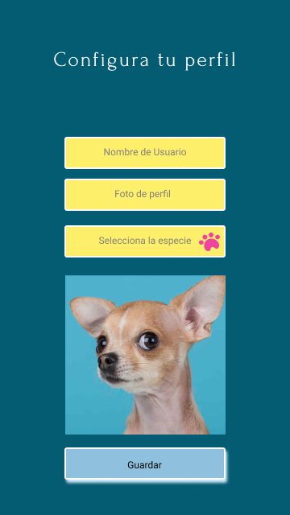

## ***PET BOOK***

## Índice

* [1. Definición del producto](#1-definición-del-producto)
* [2. Proceso de Creación](#2-proceso-de-creación)
* [3. Pruebas de usabilidad](#3-pruebas-de-usabilidad)
* [4. Obejtivos de aprendizaje](#4-objetivos-de-aprendizaje)

## 1. Definición del producto 

Siempre las mascotas han sido parte de nuestras familias y hogares, los mas mimados, por esto creamos Pet Book,
una red social pensada para compartir momentos especiales, divertidos y tiernos.

Nuestro usuario principal es el dueño de la mascota inscrita, quien se interesa tanto en su bienestar como en compartir las vivencias de su compañero fiel. Sin embargo tambien esperamos usuarios que busquen adoptar, socializar o compartir tips.

Nuestros clientes son los pet shops, veterinarias y demás comercios que venden artículos para mascotas, ya que centralizamos su nicho de mercado y promovemos una comunidad pet friendly.

Somos una red social que busca unir a las mascotas del mundo y a sus dueños.  

## 2. Proceso de Creación

## 2.1 Historias de usuario

* Historia de Usuario 1: Yo como amante de las mascotas quiero registrarme en Pet Book para ser parte de esta red social.
* Historia de Usuario 2: Yo como usuario de Pet Book quiero ingresar a la aplicación para poder interactuar en la misma.
* Historia de Usuario 3: Yo como usuario de Pet Book quiero configurar mi perfil para identificarme con mi nombre, nombre de mi mascota, su especie y foto.
* Historia de Usuario 4: Yo como usuario de esta Red Social Pet Lover quiero postear, editar y borrar mis publicaciones así como reaccionar con likes a los posts de los demás usuarios.
* Historia de Usuario 5: Yo como usuario quiero cerrar cesión en la aplicación.

## 2.2 Prototipos

### Prototipo de baja

### Prototipo de alta
#### Responsive

     

## 3. Pruebas de usabilidad

## 4. Objetivos de Aprendizaje

El objetivo principal de aprendizaje de este proyecto es construir una
[Single-page Application (SPA)](https://es.wikipedia.org/wiki/Single-page_application)
[_responsive_](../../topics/css/02-responsive) (con más de una vista / página)
en la que podamos **leer y escribir datos.**

### HTML y CSS

* [X] [Uso de HTML semántico.](https://developer.mozilla.org/en-US/docs/Glossary/Semantics#Semantics_in_HTML)
* [X] Uso de selectores de CSS.
* [X] [Uso de CSS Grid Layout](https://css-tricks.com/snippets/css/complete-guide-grid/)

### DOM y Web APIs

* [X] Uso de selectores del DOM.
* [X] Manejo de eventos del DOM (addEventListener, removeEventListener,
Event objeto, delegación de eventos)
* [X] Manipulación dinámica del DOM (appendChild | createElement | createTextNode | innerHTML | textContent | etc.)
* [X] Implementación de routing (hashchange)

### JavaScript

* [X] Uso de condicionales (if-else | switch | operador ternario)
* [X] Uso de funciones (parámetros | argumentos | valor de retorno)
* [X] Manipular arrays (filter | map | sort | reduce)
* [X] Manipular objects (key | value)
* [X] Uso ES modules (import)(export)
* [ ] Diferenciar entre expression y statements.
* [ ] Diferenciar entre tipos de datos atómicos y estructurados.
* [ ] Uso de callbacks.
* [ ] Consumo de Promesas.

### Testing

* [X] Testeo unitario.
* [ ] Testeo asíncrono.
* [X] Uso de librerias de Mock.

### Estructura del código y guía de estilo

* [X] Organizar y dividir el código en módulos (Modularización)
* [X] Uso de identificadores descriptivos (Nomenclatura | Semántica)
* [X] Uso de linter (ESLINT)

### Git y Github

* [X] Uso de comandos de git (add | commit | pull | status | push)
* [X] Manejo de repositorios de GitHub (clone | fork | gh-pages)
* [X] Colaboración en Github (branches | pull requests | |tags)
* [ ] Organización en Github (projects | issues | labels | milestones)

### Firebase

* [X] Firestore
* [X] Firebase Auth.
* [ ] Firebase security rules.
* [X] Observadores. (onAuthStateChanged | onSnapshot)

### UX

* [X] Diseñar la aplicación pensando y entendiendo al usuario.
* [X] Crear prototipos para obtener feedback e iterar.
* [X] Aplicar los principios de diseño visual (contraste, alineación, jerarquía)
* [ ] Planear y ejecutar tests de usabilidad.